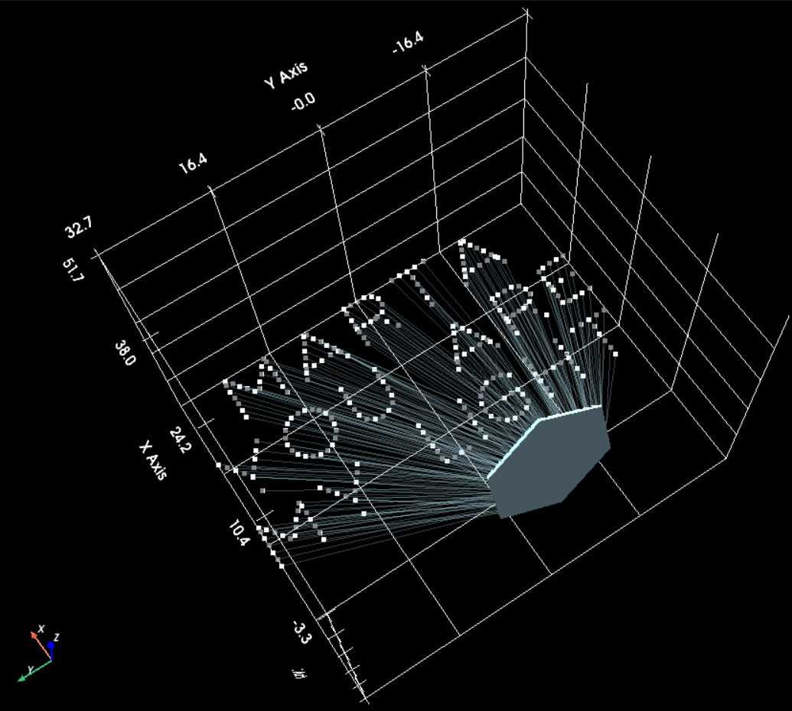
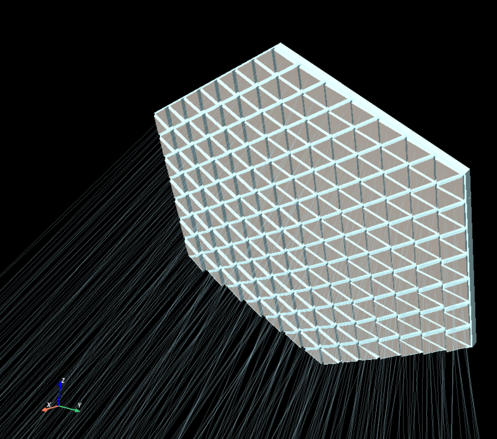

# Mirror Array

A fun project to 3D print a mirror array that, when held in front of a collimated light source (i.e., sunlight), projects a cute message onto the ground via its reflection.

Check out [the final mirror geometry here](./to_print/print_manifold.stl). See [here](design_mirror.py) for the main design code.

Concept inspired by [a similar project by @bencbartlett](https://github.com/bencbartlett/3D-printed-mirror-array), but all code in this repository is written from scratch, and the algorithmic approach to the main optimization problem is different.

The mirror consists of 294 individual triangular mirrors (roughly 1" side length) arranged into a hexagon. Each is held at a very precise, slightly-different angle, which results in a triangular spot of light projected onto the ground. The spots of light combine to form a message.

-----

The true challenge of this project isn't in computing any individual mirror orientation, or even in manufacturing the whole thing. Instead, the tricky part is determining which individual mirror should be matched to each individual spot on the the ground (the light-ray "targets"). 

The reason that this matters is that a poorly-matched mapping of mirrors to targets will result in a blurry, unreadable message if the focal plane distance or orientation is even slightly off. Ideally, adjacent light rays should be as close to perfectly collimated as possible.

This means that the mirror-target matching problem is a combinatorial optimization problem with $294!$, or $\approx 10^{600}$ possible configurations, an incomprehensibly-huge search space. To solve this, we run a simulated annealing algorithm to find a good-enough solution in a reasonable amount of time - but even this takes a supercomputer. In total, around 5 billion configurations were analyzed to obtain the actual manufactured geometry here.

